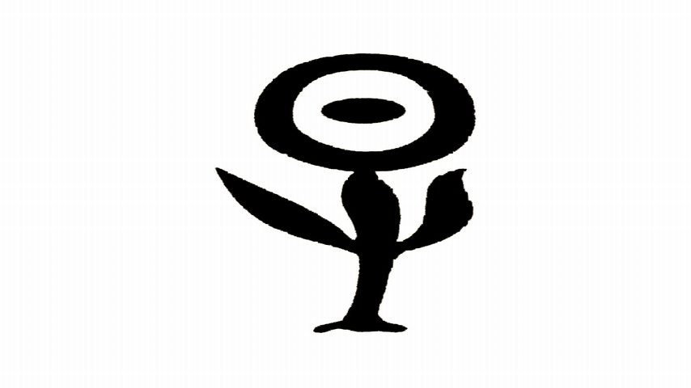
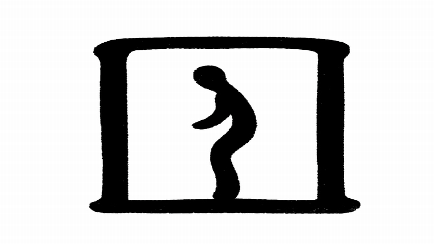

# Visualizing the Process of Hieroglyphic Evolution with Inter-Frame Attention

> This study constructed a data set named Oracle to Simplified Chinese (OtSC105) for the evolution of hieroglyphs. Using an inter-frame attention extraction algorithm, images were generated to achieve the visualization of hieroglyphic evolution from oracle bone inscriptions to modern Chinese characters. 




## Getting Started

We need the following listed environments：
torch 1.8.0
python 3.8
skimage 0.19.2
numpy 1.23.1
opencv-python 4.6.0
timm 0.6.11
tqdm


## Play with Demos

1. Download the model [checkpoints](https://drive.google.com/drive/folders/1McOO_yt_bPIf0Zk2Ypk9wESXRsXHNaL1?usp=drive_link)and put the ckpt folder into the root dir.
2. Download the dataset [OtSC105](https://drive.google.com/drive/folders/1m4s5Lr2BnVDrhrJg_Pnz24xRn_p4fwcS?usp=drive_link) or your own pictures, then put it into the folder 'Sources'.
3. Run the following commands to generate Nx (arbitrary) frame interpolation demos:

```python --model /ours_t/ours --InputPath /Your/Dataset/Path --OutputPath /Your/Output/Path --n /Insert/Frames```

### Installation 安装

通过一步步实例告诉你如何安装部署、怎样运行使用。

OS X & Linux:

```sh
Give the example
```

Windows:

```sh
Give the example
```

### Usage example 使用示例

给出更多使用演示和截图，并贴出相应代码。

## Deployment 部署方法

部署到生产环境注意事项。

## Contributing 贡献指南

Please read [CONTRIBUTING.md](#) for details on our code of conduct, and the process for submitting pull requests to us.

清阅读 [CONTRIBUTING.md](#) 了解如何向这个项目贡献代码

## Release History 版本历史

* 0.2.1
    * CHANGE: Update docs
* 0.2.0
    * CHANGE: Remove `README.md`
* 0.1.0
    * Work in progress

## Authors 关于作者

* **WangYan** - *Initial work* - [WangYan](https://wangyan.org)

查看更多关于这个项目的贡献者，请阅读 [contributors](#) 

## License 授权协议

这个项目 MIT 协议， 请点击 [LICENSE.md](LICENSE.md) 了解更多细节。
